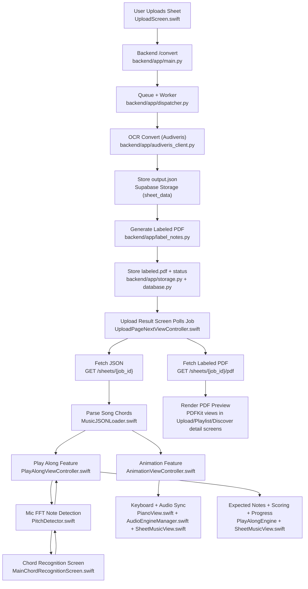
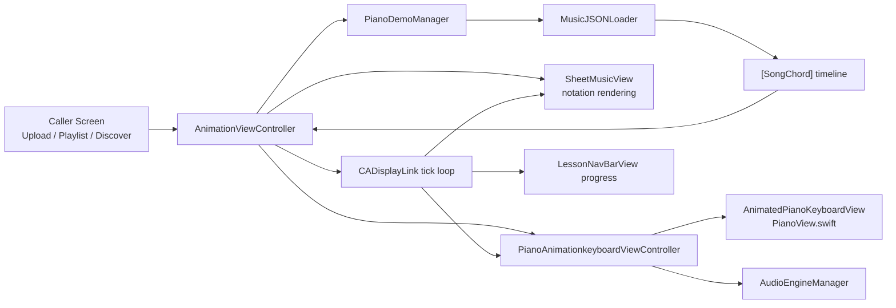

# Re-Hearse Core Features: Easy but Detailed Architecture Guide

This guide explains how the 4 core features work in the current codebase, with a focus on:

- which file starts each feature
- which files contain the actual logic
- what data goes in and out
- where to edit safely when you want to change behavior

Features covered:

1. Animation
2. Play Along
3. Note Labelling
4. Chord Recognition

---

## How to Read This Document

If you are new to the project, use this order:

1. Read `Quick Map` for top-level ownership.
2. Read `Shared Core Files` to understand what is reused.
3. Read each feature section:
   - `What it does`
   - `Main files`
   - `Runtime flow`
   - `Where to edit`
   - `Things that look legacy`

---

## Quick Map (Most Important Files Per Feature)

| Feature | Main controller file(s) | Core logic file(s) |
| --- | --- | --- |
| Animation | `Screens/MainAnimationScreen/AnimationViewController.swift` | `Screens/MainAnimationScreen/MusicJSONLoader.swift`, `Screens/MainAnimationScreen/SheetMusicView.swift`, `Screens/MainAnimationScreen/PianoView.swift` |
| Play Along | `Screens/MainPlayAlongScreen/PlayAlongViewController.swift` | `PlayAlongEngine` inside same file, `Common/Audio/PitchDetector.swift`, `Models/PianoDataManager.swift` |
| Note Labelling | `Screens/MainUploadScreen/UploadPageNextViewController.swift` (frontend), `backend/app/main.py` (API) | `backend/app/dispatcher.py`, `backend/app/label_notes.py`, `backend/app/storage.py` |
| Chord Recognition | `Screens/MainChordRecognitionScreen/MainChordRecognitionScreen.swift` | `Common/Audio/PitchDetector.swift` (active live logic) |

---

## End-to-End Flow Diagram

---

## Shared Core Files (Used by Multiple Features)

These files are cross-feature foundations:

| File | Why it matters |
| --- | --- |
| `Screens/MainAnimationScreen/MusicJSONLoader.swift` | Converts converted-sheet JSON into timed note groups (`SongChord`). Used by Animation + Play Along. |
| `Screens/MainAnimationScreen/SongChord.swift` | Shared note-group model (`leftHandNotes`, `rightHandNotes`, `duration`, `globalTick`). |
| `Screens/MainAnimationScreen/SheetMusicView.swift` | Draws sheet notation and keeps scroll position in sync with ticks/progress. |
| `Screens/MainAnimationScreen/PianoView.swift` | Main keyboard UI (`AnimatedPianoKeyboardView`) for both Animation + Play Along. |
| `Screens/MainAnimationScreen/AudioEngineManager.swift` | Shared sound playback system (AVAudioEngine + sampler). |
| `Common/Audio/PitchDetector.swift` | Shared mic + FFT detector (used in Play Along and Chord Recognition). |
| `Models/PianoDataManager.swift` | Converts parsed chords into play-along groups. |

---

## 1) Animation

### What this feature does

Animation is the full “auto-play + visualize” mode for converted sheet music.  
Given converted JSON from upload/discover/playlist flows, it:

- parses note/chord timing
- draws and scrolls notation
- highlights keys by hand (left/right)
- plays notes through the piano engine
- keeps all three surfaces in sync:
  - audio
  - keyboard animation
  - sheet position

### Core architecture (at a glance)

### Main files and exact responsibilities

| File | Responsibility |
| --- | --- |
| `Screens/MainAnimationScreen/AnimationViewController.swift` | The orchestrator. Owns playback state machine, chord indexing, seeking, tempo changes, progress math, display loop, orientation handling, and UI overlays/settings. |
| `Screens/MainAnimationScreen/PianoAnimationkeyboardViewController.swift` | Keyboard+audio execution layer for each chord event. Highlights left/right notes, manages hand labels, and schedules note-off timing for articulation clarity. |
| `Screens/MainAnimationScreen/MusicJSONLoader.swift` | Converts Audiveris-style JSON into a normalized timed sequence (`SongChord`) with stable `globalTick` and computed durations. |
| `Screens/MainAnimationScreen/PianoDemoManager.swift` | Simple loader/iterator over `SongChord` data; decouples source data from playback controller. |
| `Screens/MainAnimationScreen/SheetMusicView.swift` | Pure rendering layer for notation and tick-based scroll positioning. |
| `Screens/MainAnimationScreen/PianoView.swift` | UI implementation of full keyboard (`AnimatedPianoKeyboardView`, `AnimatedPianoKeyView`) including hand color cues and animations. |
| `Screens/MainAnimationScreen/AudioEngineManager.swift` | Sound generation and note lifecycle (note-on/off, instrument switching, engine sessions). |
| `Screens/MainAnimationScreen/TopView.swift` | `LessonNavBarView` (back/menu/progress slider) used by Animation. |
| `Screens/MainAnimationScreen/SongChord.swift` | Data contract for one playable event (left notes, right notes, duration, tick). |

### Entry points into Animation

| File | Launch path |
| --- | --- |
| `Screens/MainUploadScreen/UploadPageNextViewController.swift` | Uses freshly converted JSON from upload pipeline. |
| `Screens/MainPlaylistScreen/SongDetailsPage.swift` | Launches from playlist song detail with fetched converted JSON. |
| `Screens/MainDiscoverScreen/DiscoverSongDetailViewController.swift` | Launches from discover song detail with fetched converted JSON. |

### Data contract used by Animation

`AnimationViewController` receives:

- `sheetMusicData: Data?` (converted JSON bytes)
- `songTitle: String` (UI label only)

Converted JSON is parsed into `[SongChord]`:

- `leftHandNotes: [String]`
- `rightHandNotes: [String]`
- `duration: Double`
- `globalTick: Int`

This means Animation is tick-driven but plays in wall-clock time.

### Detailed runtime flow (controller lifecycle)

1. `viewDidLoad`
   - builds layout (`sheetCard`, piano child VC, overlay, nav bar)
   - wires callbacks (back, seek, tempo, menu)
   - calls `loadChords()`
2. `loadChords()`
   - chooses data source (`sheetMusicData` or debug fallback)
   - uses `PianoDemoManager` -> `MusicJSONLoader` to parse chords
   - computes `totalDuration`
   - loads same JSON into `SheetMusicView`
3. `viewWillAppear`
   - hides tab/nav bars
   - forces landscape
4. `startPlayback()`
   - validates chord list
   - creates `CADisplayLink`
   - toggles overlay/UI states
5. `tick(_:)` each frame
   - determines current chord
   - computes adjusted duration by tempo
   - interpolates current tick position for sheet
   - updates nav progress
   - triggers keyboard/audio when entering new chord
6. `stopPlayback(reset:)`
   - invalidates display link
   - stops notes
   - optionally resets chord index and sheet progress
7. `viewWillDisappear`
   - stops playback and restores portrait orientation

### Timing and synchronization internals

Animation keeps several timing variables:

- `chordIndex`: current chord position
- `elapsedInChord`: elapsed wall time inside current chord
- `elapsedTotal`: elapsed wall time across whole song
- `totalDuration`: sum of chord durations at base tempo
- `tempoMultiplier`: live playback multiplier

Important behavior:

1. Chord duration is tempo-adjusted at runtime:
   - `adjDuration = chord.duration / tempoMultiplier`
2. Sheet position uses interpolated tick between current and next chord:
   - smooth movement instead of jumping per chord
3. Progress updates are tied to absolute wall-time accumulation (`elapsedTotal`)
4. Seek recalculates both:
   - timeline index/state
   - sheet tick interpolation state

This is why sync stays stable even after repeated seek + tempo changes.

### Seek behavior (critical implementation details)

Seek has 2 paths:

- double-tap shortcuts (`seekBy(-5)` and `seekBy(5)`)
- slider scrub (`seekToProgress(...)`)

Both paths:

1. locate correct chord index for target time
2. recompute local elapsed time in chord
3. recompute absolute elapsed total
4. reset keyboard/audio current sounding state
5. update sheet by interpolated tick immediately
6. update nav progress

This prevents the common bug where audio, sheet, and progress drift after scrubbing.

### Tempo behavior

Tempo changes come from menu callbacks and set `tempoMultiplier`.

Effects:

- shorter/longer effective chord durations during tick loop
- progress still mapped against absolute song duration
- seek math compensates to avoid misalignment

Tempo range is constrained in `SettingsMenuView` to keep behavior predictable.

### UI components inside Animation runtime

`AnimationViewController` directly manages multiple UI systems:

- `LessonNavBarView` from `TopView.swift`
  - back button
  - progress slider
  - menu button
- `PlaybackOverlay`
  - play/pause center control
  - double-tap seek visual feedback
- `SettingsMenuView`
  - tempo controls
  - instrument selector (via `AudioEngineManager.switchInstrument`)

Because these are tightly coupled to playback state, most are intentionally kept in/near the controller file.

### Audio path details

Audio playback path:

1. `AnimationViewController` enters new chord
2. calls `PianoAnimationkeyboardViewController.playChord(...)`
3. keyboard VC highlights keys
4. keyboard VC sends note-on/note-off to `AudioEngineManager`
5. `AudioEngineManager` uses sampler/soundfont or fallback tone path

`PianoAnimationkeyboardViewController` also cancels pending note-off tasks before new chord attacks to reduce muddy overlap.

### JSON parsing details that affect Animation quality

`MusicJSONLoader` does several important normalization steps:

- reads divisions and tempo from JSON metadata
- tracks local measure ticks with staff/voice separation
- applies backup behavior correctly inside measure timing
- converts events to global ticks
- groups simultaneous notes into one `SongChord`
- computes chord duration primarily from distance to next tick

This logic is why converted scores play with stable event spacing instead of collapsing into too-few events.

### Where to edit for specific Animation changes

| Goal | Start editing here |
| --- | --- |
| Fix drift between sheet and audio | `Screens/MainAnimationScreen/AnimationViewController.swift` (`tick`, `seekBy`, `seekToProgress`) |
| Improve rhythm/timing parse from JSON | `Screens/MainAnimationScreen/MusicJSONLoader.swift` |
| Change notation movement behavior | `Screens/MainAnimationScreen/SheetMusicView.swift` |
| Change key highlight style/hand colors | `Screens/MainAnimationScreen/PianoView.swift` |
| Change note articulation/attack/release feel | `Screens/MainAnimationScreen/PianoAnimationkeyboardViewController.swift` |
| Change instrument/sound rendering | `Screens/MainAnimationScreen/AudioEngineManager.swift` |
| Change nav/slider/menu UI | `Screens/MainAnimationScreen/TopView.swift` and `AnimationViewController.swift` |

### Debug checklist for Animation issues

If animation “looks wrong”, use this quick path:

1. No notes playing:
   - check `AudioEngineManager` session acquired/released correctly
   - verify `playChord(...)` gets non-empty notes
2. Sheet not moving:
   - verify `tick(_:)` runs
   - verify `sheetCard.updateToTick(...)` receives changing tick
3. Slider/progress mismatch:
   - inspect `elapsedTotal` vs `totalDuration`
   - inspect `seekToProgress(...)` recalculation path
4. Wrong chord density/timing:
   - inspect `MusicJSONLoader.parse(...)` event grouping and duration calc
5. Stuck orientation:
   - inspect `viewWillAppear/viewWillDisappear` orientation update paths

### Animation-specific risks and gotchas

- Playback state is distributed across multiple timing variables, so partial edits can break sync if only one variable is updated.
- Seek changes must update both musical position and wall-time accumulators.
- Tempo and seek logic are coupled; test both together.
- UI overlay gestures can conflict with nav slider interaction if hit-testing rules are changed.

### Files near Animation that look non-core/legacy

| File | Note |
| --- | --- |
| `Common/Music_Components/AnimatedKeyboardView.swift` | Older demo keyboard component; not the active Animation keyboard. |
| `Common/Music_Components/PianoKeyView.swift` | Supports the older demo component above. |
| `Screens/MainAnimationScreen/PianoLogic.swift` | Contains chord utility logic, but not in the active Animation playback runtime path. |

---

## 2) Play Along

### What this feature does

Play Along is a guided practice mode:

- shows expected notes
- listens to user notes (mic or keyboard)
- marks correct vs wrong notes
- advances through score groups
- tracks progress and session report

### Main files and responsibilities

| File | Responsibility |
| --- | --- |
| `Screens/MainPlayAlongScreen/PlayAlongViewController.swift` | Main screen + orchestration. Handles loading, mic permission, session lifecycle, callbacks, and finish reporting. |
| `PlayAlongEngine` (inside same file) | Core rule engine for expected notes, matching logic, progression, scoring, tempo pulse, seek, and finish conditions. |
| `Common/Audio/PitchDetector.swift` | Mic capture + FFT note detection input to Play Along. |
| `Models/PianoDataManager.swift` | Converts parsed `SongChord` sequence into grouped note targets. |
| `Screens/MainAnimationScreen/MusicJSONLoader.swift` | Parses JSON into timed `SongChord` data used by Play Along. |
| `Screens/MainAnimationScreen/SheetMusicView.swift` | Notation display + progress updates + wrong-note markers. |
| `Screens/MainAnimationScreen/PianoView.swift` | Hinting keyboard and on-screen input surface. |
| `Screens/MainAnimationScreen/AudioEngineManager.swift` | Optional key sound output for interactions. |

### Where Play Along gets launched

| File | Launch path |
| --- | --- |
| `Screens/MainUploadScreen/UploadPageNextViewController.swift` | Launch from freshly converted upload. |
| `Screens/MainPlaylistScreen/SongDetailsPage.swift` | Launch from playlist song detail. |
| `Screens/MainDiscoverScreen/DiscoverSongDetailViewController.swift` | Launch from discover song detail. |

### Runtime flow (step-by-step)

1. Caller passes converted JSON to `PlayAlongViewController.sheetMusicData`.
2. `loadSheetDataIfNeeded()` parses JSON via `MusicJSONLoader.loadSongChords(from:)`.
3. Controller loads same JSON into `SheetMusicView`.
4. Parsed sequence is passed to `PlayAlongEngine.start(with:)`.
5. `PlayAlongEngine` converts chords to playable groups via `PianoDataManager`.
6. Engine sends current expected notes and progress through delegate.
7. Controller updates nav text, hints on keyboard, and sheet progress.
8. User input sources:
   - mic path: `PitchDetector` -> detected notes
   - keyboard path: on-screen key taps
9. `handleInput(note:)` calls `engine.processNote(note)`.
10. Correct note:
   - removes note from expected set
   - once group complete, advances to next group
11. Wrong note:
   - increments mistakes
   - triggers visual feedback + persistent wrong marker on sheet
12. Final group complete -> engine sends finish callback -> report view appears.

### Where to edit when changing Play Along

| Change needed | Primary file to edit |
| --- | --- |
| Match/scoring rules, progression, debounce | `Screens/MainPlayAlongScreen/PlayAlongViewController.swift` (`PlayAlongEngine` section) |
| Mic behavior and detection robustness | `Common/Audio/PitchDetector.swift` |
| Note group structure | `Models/PianoDataManager.swift` |
| Hint drawing and keyboard visuals | `Screens/MainAnimationScreen/PianoView.swift` |
| Sheet feedback markers | `Screens/MainAnimationScreen/SheetMusicView.swift` |

### Important design note

Play Along logic is intentionally concentrated in one file today:

- `PlayAlongViewController`
- `PlayAlongEngine`
- `PlayAlongNavBar`
- `PlayAlongReportView`

This makes onboarding easy (single file), but long-term refactors may split it for maintainability.

---

## 3) Note Labelling

### What this feature does

Note Labelling is mostly a backend pipeline. It:

- accepts uploaded PDF/image
- runs OCR/music parsing through Audiveris
- generates `output.json`
- computes exact note label positions
- writes labels (like `C4`, `A#4`) onto a new PDF
- stores labeled PDF and serves it to app screens

Frontend mainly monitors status and displays results.

### Frontend files and responsibilities

| File | Responsibility |
| --- | --- |
| `Screens/MainUploadScreen/UploadPageNextViewController.swift` | Main post-upload orchestrator: polls job state, fetches converted JSON and labeled PDF, displays preview, unlocks Animation/Play Along entry. |
| `Screens/MainUploadScreen/UploadScreen.swift` | Initial upload flow; routes to next-step processing screen. |
| `Screens/MainUploadScreen/AllUploadsViewController.swift` | Re-opens previous jobs and routes back into upload result flow. |
| `Screens/MainPlaylistScreen/SongDetailsPage.swift` | Fetches original/labeled PDFs and converted JSON for playlist songs. |
| `Screens/MainDiscoverScreen/DiscoverSongDetailViewController.swift` | Same as above for discover songs. |
| `Models/Song.swift` | Defines and resolves `labeledPdfPath` and `outputJsonPath` references. |

### Backend files and responsibilities

| File | Responsibility |
| --- | --- |
| `backend/app/main.py` | API endpoints for convert, status, JSON retrieval, labeled PDF retrieval. |
| `backend/app/dispatcher.py` | Worker pipeline from upload to final labeled output + status updates. |
| `backend/app/audiveris_client.py` | HTTP client for Audiveris conversion call. |
| `backend/app/label_notes.py` | Core note-label placement and PDF writing logic. |
| `backend/app/storage.py` | Upload/download for JSON and labeled PDF in Supabase storage. |
| `backend/app/database.py` | Persists job state, `label_status`, warnings, and metadata. |

### End-to-end runtime flow

1. Upload starts from `UploadScreen`.
2. Backend endpoint `POST /convert` (`backend/app/main.py`) creates job.
3. Background worker (`dispatcher.py`) runs:
   - download source PDF
   - call Audiveris via `audiveris_client.py`
   - save `output.json`
   - normalize geometry
   - run `label_notes.py`
   - save `labeled.pdf`
   - update job status (`completed` or `completed_with_warning`)
4. Frontend `UploadPageNextViewController` polls status.
5. On completion, frontend fetches:
   - `/sheets/{job_id}` -> converted JSON
   - `/sheets/{job_id}/pdf` -> labeled PDF
6. App displays labeled PDF and reuses JSON in Animation + Play Along.

### Deep detail: what `label_notes.py` actually computes

`backend/app/label_notes.py` is the real implementation center of note labelling.

Core operations inside it:

1. Parse MusicXML-like JSON from Audiveris.
2. Read scaling (`millimeters`, `tenths`) and compute conversion to PDF points.
3. Derive staff geometry from MusicXML tenths values.
4. Track clef/staff assignments for each note.
5. Convert pitch (`step`, `alter`, `octave`) to display label text.
6. Calculate note-head Y based on diatonic pitch index and clef top-line reference.
7. Compute X based on measure/system offsets and `@default-x`.
8. Position labels below staff.
9. Prevent overlap:
   - enforce minimum X gaps
   - push labels down when collisions happen
   - avoid barline clipping near measure boundaries
10. Write text on page with PyMuPDF and save final PDF.

### Where to edit when changing Note Labelling

| Change needed | Primary file to edit |
| --- | --- |
| Label text format (`Bb4`, `C#5`, etc.) | `backend/app/label_notes.py` (`pitch_label`) |
| Label placement geometry | `backend/app/label_notes.py` |
| Pipeline order / retry behavior | `backend/app/dispatcher.py` |
| API response behavior to app | `backend/app/main.py` |
| Frontend job polling or load UX | `Screens/MainUploadScreen/UploadPageNextViewController.swift` |

---

## 4) Chord Recognition

### What this feature does today (important reality)

The active screen currently behaves as a live note detector:

- microphone input
- FFT detection
- display strongest detected note and frequency

It is named chord recognition, but full multi-note chord naming is not the active runtime path yet.

### Main files and responsibilities

| File | Responsibility |
| --- | --- |
| `Screens/MainChordRecognitionScreen/MainChordRecognitionScreen.swift` | Active screen UI and control flow for start/stop, permissions, waveform, and display updates. |
| `Common/Audio/PitchDetector.swift` | Active audio-analysis engine producing detected note list + frequency + amplitude. |

### Runtime flow (step-by-step)

1. User opens `ChordRecognitionViewController` (`MainChordRecognitionScreen.swift`).
2. User taps mic button.
3. Screen checks permission and requests if needed.
4. On approval, `PitchDetector.startListening()` configures AVAudioSession + AVAudioEngine.
5. Input tap captures mic frames.
6. FFT pipeline detects peaks and maps to note names.
7. Delegate callback `pitchDetectorDidDetect(...)` updates:
   - note label
   - frequency label
   - waveform
   - status text

### Where to edit when changing Chord Recognition

| Change needed | Primary file to edit |
| --- | --- |
| Start/stop behavior, UI states, permissions | `Screens/MainChordRecognitionScreen/MainChordRecognitionScreen.swift` |
| Detection sensitivity/FFT strategy/noise gating | `Common/Audio/PitchDetector.swift` |
| Waveform visual behavior | `Screens/MainChordRecognitionScreen/MainChordRecognitionScreen.swift` |

### Files around this feature that look non-active/legacy

| File | Note |
| --- | --- |
| `Screens/MainChordRecognitionScreen/ChordAudioManager.swift` | Timer-based simulated detector; does not appear to be wired into active live path. |
| `Features/ChordRecognition/ChordRecognition.swift` | Minimal placeholder view controller, not the active screen path. |
| `Screens/MainAnimationScreen/PianoLogic.swift` | Contains chord-detection utilities not currently connected to the active chord-recognition screen runtime path. |

---

## Cross-Feature Data Journey (Upload to Practice)

This is the most important big-picture flow:

1. User uploads score from `UploadScreen`.
2. Backend creates job and processes via Audiveris + `label_notes`.
3. Backend stores:
   - converted JSON (`output.json`)
   - labeled PDF (`labeled.pdf`)
4. Frontend `UploadPageNextViewController` polls until complete.
5. Once ready:
   - PDF preview is shown to user
   - JSON is parsed by `MusicJSONLoader`
6. User opens:
   - Animation -> playback + synced sheet
   - Play Along -> guided expected-note practice

So the conversion/note-labelling pipeline is upstream of Animation and Play Along.

---

## Practical “Where Do I Start?” Cheat Sheet

If you need to debug a feature quickly:

### Animation not syncing?

Check in this order:

1. `AnimationViewController.tick(_:)`
2. `MusicJSONLoader.parse(...)`
3. `SheetMusicView.updateToTick(...)`

### Play Along marking notes wrong unexpectedly?

Check in this order:

1. `PitchDetector` threshold/debounce behavior
2. `PlayAlongEngine.processNote(_:)`
3. canonical note normalization in `PlayAlongEngine.canonicalNoteName(_:)`

### Labeled PDF missing or blank?

Check in this order:

1. `backend/app/dispatcher.py` pipeline logs/status
2. `backend/app/label_notes.py` label placement path
3. `backend/app/storage.py` upload/download path
4. frontend polling in `UploadPageNextViewController`

### Chord screen not detecting properly?

Check in this order:

1. permission + start path in `MainChordRecognitionScreen.swift`
2. FFT/gating in `PitchDetector.swift`
3. UI update path in `pitchDetectorDidDetect(...)`

---

## Final Summary

The architecture is strongest and most complete for:

- Animation
- Play Along
- Note Labelling pipeline

Chord Recognition is functional but currently behaves primarily as note detection in the live path.

If you remember only one thing:

- `AnimationViewController.swift` controls animation behavior.
- `PlayAlongViewController.swift` controls play-along behavior.
- `label_notes.py` controls note-label generation logic.
- `MainChordRecognitionScreen.swift` + `PitchDetector.swift` control chord-recognition screen behavior.
